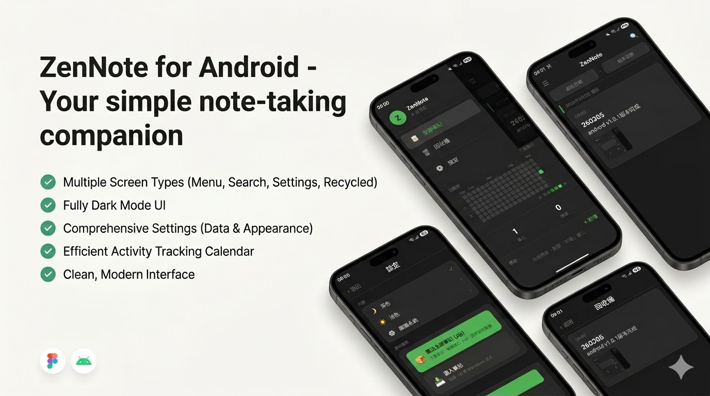

# ZenNote


> ZenNote 是一款基於 React Native 的本地筆記應用，專注於極速、隱私與離線體驗。所有資料僅儲存於本地端，無需擔心雲端隱私外洩。


<div align="center">
	
</div>


---

## 特色與功能

- 📝 **本地筆記**：所有資料僅儲存於本地，無需註冊帳號。
- 🔒 **隱私安全**：支援資料加密，完全離線，符合 GDPR。
- ⚡ **極速啟動**：即開即用，無多餘等待。
- 🌙 **多主題切換**：深色、淺色、跟隨系統主題。
- 🔍 **強大搜尋**：支援關鍵字、標籤、圖片條件複合搜尋。
- 🏷️ **標籤管理**：自訂標籤，快速分類。
- 🗑️ **回收桶**：誤刪可還原，資料不怕遺失。
- 📦 **匯入/匯出/備份**：支援 .zip、Markdown 格式，完整備份還原。
- 📊 **活躍度統計**：視覺化日曆熱力圖，追蹤筆記習慣。
- 🧪 **高測試覆蓋率**：Jest + RTL 單元/整合/安全/效能測試。

---

## 目錄結構

```
├── App.tsx                # 應用進入點
├── src/                   # 主程式碼
│   ├── components/        # UI 元件
│   ├── hooks/             # React hooks
│   ├── models/            # 資料模型
│   ├── modules/           # 功能模組（editor, main, search, ...）
│   ├── navigation/        # 導航設定
│   ├── services/          # 業務邏輯/資料存取
│   ├── store/             # 狀態管理（Zustand）
│   ├── theme/             # 主題/樣式
│   └── utils/             # 工具函式
├── screens/               # 各主畫面
├── assets/                # 靜態資源
├── docs/                  # 設計稿、說明
├── specs/                 # 規格、資料模型、計劃
├── tests/                 # 單元/整合/效能/安全測試
├── patches/               # 第三方套件修補
├── ...
```

---

## 安裝與啟動

1. **安裝依賴**
	 ```sh
	 npm install
	 # 或
	 yarn install
	 ```
2. **啟動 Android 模擬器或連接實體裝置**
3. **啟動 App**
	 ```sh
	 npm run android
	 # 或
	 yarn android
	 ```

---

## 測試

- **執行所有單元/整合/效能/安全測試**
	```sh
	npm test
	# 或
	yarn test
	```
- **產生測試覆蓋率報告**
	```sh
	npm run coverage
	# 或
	yarn coverage
	```

---

## 主要技術棧

- React Native 0.7x
- TypeScript 5.x
- React Navigation
- Zustand（狀態管理）
- AsyncStorage / WatermelonDB（本地資料）
- Jest + React Native Testing Library（測試）
- Tailwind CSS（NativeWind）

---

## 注意事項

- 嚴格遵循設計稿（`docs/ui/*.jpg`）
- 僅本地資料，無雲端同步
- 支援離線、資料加密、GDPR
- 程式碼品質與測試覆蓋率需達標
- 若需自訂/修補第三方套件，請參考 `patches/`

---

## 參考文件與設計稿

- [快速上手與規格](specs/001-ref-specify/quickstart.md)
- [資料模型](specs/001-ref-specify/data-model.md)
- [設計稿（UI JPG）](docs/ui/)

---

如需更多細節，請參閱 `specs/001-ref-specify/` 內各文件與設計稿。
